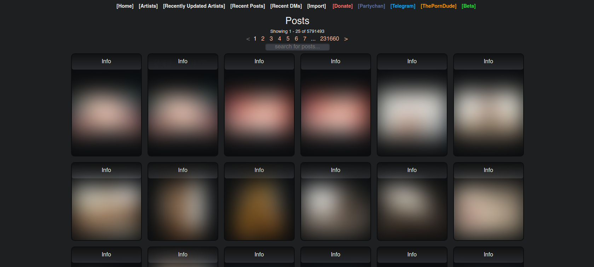

# Kemono   Project

*Frontend designed for PaySite leaking.*

 
 

[![Button Website]][Website]

[![Button Setup]][Setup]   
[![Button FAQ]][FAQ]

[![Button Develop]][Develop]

 
 

 

<!----------------------------------------------------------------------------->

[Website]: https://kemono.party/

[Develop]: docs/Develop.md
[Setup]: docs/Setup.md
[FAQ]: docs/FAQ.md

<!---------------------------------[ Buttons ]--------------------------------->

[Button Website]: https://img.shields.io/badge/Website-e6702f?style=for-the-badge&logoColor=white&logo=FirefoxBrowser

[Button Develop]: https://img.shields.io/badge/Develop-3955A3?style=for-the-badge&logoColor=white&logo=VisualStudioCode
[Button Setup]: https://img.shields.io/badge/Setup-3EAAAF?style=for-the-badge&logoColor=white&logo=GitBook
[Button FAQ]: https://img.shields.io/badge/FAQ-569A31?style=for-the-badge&logoColor=white&logo=AskUbuntu